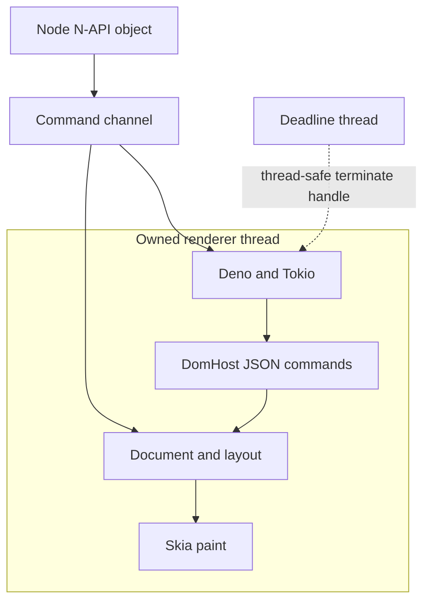

# canvas-html Deno runtime POC — Phase 2

Prepared 2026-10-05T21:18:34.268217+00:00. Linux x64 only. Node 24.19.0, Rust 1.99.0,
`deno_core` 0.412.0, rusty_v8 crate 150.4.0, napi-rs 3.14.1.
The complete Phase 1 `POC_RESULTS.md` was read before implementation.

## Decision

**CONDITIONAL GO** for continuing an engine-neutral JS/DOM architecture while
keeping Boa as the production runtime. **Do not replace Boa in production yet.**

A persistent Deno runtime is viable for worker-parallel deterministic rendering
in the tested Linux/Node configuration **with Model B, a dedicated runtime thread**.
The caller-thread prototype crashed with two live instances. The final prototype
passed aggressive lifecycle, shutdown, determinism, minimal DOM, and actual GSAP
selector playback checks.

The conditions are native allocation retained during renderer churn, current RSS
measurement in a normal host, broader Node/OS validation, and a shared DOM adapter
with production-compatible contracts. No Phase 3 code was started.

## Evidence classification

| Class | Claim and evidence |
|---|---|
| Measured | Model A: one instance construction, eval, and close probes exited 0; two instances caused `SIGTRAP` with `Cannot create a handle without a HandleScope`. Logs: `model-a-*.json/.stderr`, archived source: `model-a-source/`. |
| Measured | Model B: 2,111 runtime create/drop cycles completed in the cycle test, with created/dropped counts equal and zero live execution/deadline threads at the end. |
| Measured | A single runtime remained alive through 10,000 evals, 10,000 seeks, 1,000 DOM update evals, and 1,000 renders; runtime creation count did not increase. |
| Measured | 16 simultaneous renderers, workers up to 8, repeated forced/graceful worker exits, and normal process exit with live native objects passed. |
| Measured | Five fresh DOM scenes produced identical RGBA SHA-256 hashes. GSAP 3.15.0 selector tween and unpaused ticker playback produced the expected transform/opacity values and matching hashes. |
| Measured | Original Boa smoke and worker determinism suites passed before and after. Seven production source/manifest/API files match the supplied ZIP byte for byte. |
| Source-inspected | The pinned rusty_v8 `OwnedIsolate` enters on construction and requires reverse creation order for drop. Deno wraps this `OwnedIsolate`. N-API object lifetime does not impose that drop order. |
| Source-inspected | Runtime, `Rc` document host, and painter are constructed inside one Rust thread closure and never leave it. The compiler checks `Send` on the channel closure/payloads; there is no experimental `unsafe impl Send` for a runtime, document, or wrapper. |
| Source-inspected | V8 handles stay in `phase2-engine`. `phase2-host` uses only traits, time numbers, and JSON; document/layout/paint code contains no V8 or deno_core handles. |
| Source-inspected | rusty_v8 explicitly documents `IsolateHandle` as Send + Sync and `terminate_execution` as thread-safe; the deadline thread uses only that handle. |
| Inferred | Model A's multi-instance failure is consistent with entered-isolate/scope ownership. The native fatal message identifies scope state, but no symbol-by-symbol native backtrace proves the entire failure chain. The reverse-drop restriction is an additional independent lifecycle objection. |
| Inferred | Remaining retained allocation belongs to native rendering/backend lifecycle categories, rather than Deno JS execution alone: constructor/eval controls stay nearly flat; render controls grow; a Boa paint-only control also retains allocation. An allocation-stack profile is still needed to identify the exact owner. |
| Untested | Current resident RSS, other Node versions, long production videos, adversarial native paint hangs, signals/hard process kill, other operating systems/architectures, and browser-wide DOM/CSS compatibility. |

## Runtime lifecycle and thread model

The final class is private and unstable: `ExperimentalDenoRenderer`.
It implements `eval(source)`, `seek(ms)`, `render(png?)`, `jsErrors()`,
`stats(collect?)`, and idempotent `close()`.

Each instance starts one owned execution thread. That thread creates a Tokio
current-thread executor, one persistent Deno `JsRuntime`, a document, and a reused
Skia painter. Calls send Rust-owned strings, JSON values, time numbers, or pixel
vectors through synchronous channels. No N-API Buffer or JS/V8 object crosses the
execution channel. Buffers are made on the Node callback thread from returned
`Vec<u8>` values.

The renderer records its runtime thread ID and checks it before every dispatched
operation. Since all runtime-containing structures remain local to that closure,
a Node finalizer can run without moving V8: it sends Stop, waits for the runtime
and document to drop on their owner thread, and joins the thread. The deadline
thread is stopped and joined before the isolate drops. No isolate is recreated
between calls.

`initPlatform()` initializes Deno's process-wide V8 platform on the Node main
thread before workers are created. The constructor requires this initialization.
Workers reuse the process-wide platform and each create a separate owned renderer
thread. The Tokio enter guard is used for JS work and destruction. No raw Node
isolate pointers or symbol-renaming tricks were used. IPC was unnecessary after
Model B passed.

Model B is recommended. It pays channel/extra-thread costs, but independent
instances can close in any order. Model A is not the recommended baseline for
further work with these pinned dependencies. A caller-thread redesign would need
careful documented isolate-entry management and renewed lifecycle testing.

### Lifecycle matrix

Each explicit cycle constructs, evaluates, seeks at 0/5/10 ms, renders three
frames, checks persistent state, and closes. Additional GC cycles omit close.
Each subprocess has a 240-second external deadline. The Model A failure probe
has a 30-second deadline.

| Sequential group | Seconds | Result |
|---|---:|---|
| 1 | 0.366 | passed |
| 10 | 0.246 | passed |
| 100 | 2.268 | passed |
| 1000 | 24.808 | passed |

The groups run sequentially in one process, for 1,111 explicit cycles; another
1,000 cycles use Node GC/finalizers. Total: **2,111 created, 2,111 dropped**, zero
remaining execution/deadline threads. This counts prototype-owned threads; the
process-wide V8/platform/backend pools are not counted as leaked renderer threads.

| Case | Result |
|---|---|
| One long-lived renderer | 10,000 eval + 10,000 seek + 1,000 render; runtime count remains one |
| Simultaneous instances | 1, 2, 4, 8, 10, 16; deliberately non-LIFO close order passes |
| Graceful worker groups | 1, 2, 4, 8; 100 eval/seek/render operations per worker; identical hashes |
| Live renderer at worker exit | Environment finalization drops the native renderer safely |
| Forced termination | 8 idle-live workers + 8 busy-live workers; all native runtimes drop |
| Repeated normal worker creation/destruction | 16 additional workers |
| Worker suite total | 48 runtime creations and 48 drops; no owned threads remaining |
| Normal Node exit, one live renderer | Finalizer audit reaches zero live runtimes and threads |
| Normal Node exit, eight live renderers | All eight finalize; final audit is zero |
| Explicit close then exit | Passes; finalizer sees a closed object |
| JS exception then normal exit | Passes; runtime destruction still occurs |
| Ordinary eval exception followed by eval | Error is recorded; next eval returns 42 |
| Infinite eval / Promise microtask | ~100 ms JS deadline terminates execution; runtime becomes poisoned; close works |

Forced worker termination is **not immediate during a synchronous native call**.
Idle-live termination took 2.0–5.7 ms. Busy workers were
sent terminate after a 30 ms delay and exited 253.2–259.5 ms
from the ready message, with `evalTimeoutMs: 250`. This demonstrates watchdog-bounded
JS termination followed by owner-thread cleanup. It does not guarantee cleanup
for an uninterruptible native layout/paint operation, SIGKILL, or a process crash.

Audit logs record Node finalizer caller/current thread IDs, runtime owner IDs,
cleanup errors, and live/create/drop/thread counters. The Model B compatibility
field `wrongThreadDrops` is always zero by construction; it is not an independent
V8 thread audit. Owner checks, channel construction, matched runtime drop counts,
and joined execution threads are the actual evidence.

## Memory

**Current RSS remains unavailable:** `process.memoryUsage()` fails with
`ENOENT: uv_resident_set_memory` because `/proc` is absent. Node
`process.resourceUsage().maxRSS` works; tables show **peak RSS**, a process-wide
high-water value that cannot fall after cleanup. This does not satisfy a current
RSS/steady-residency measurement. The limitation is a reason for conditional go.

The fallback obtains Node heap/external values from `node:v8`, embedded V8 heap,
external/context/handle statistics from the renderer, and glibc `mallinfo2`.
Native allocated bytes do not include every mmap/V8 reservation; do not add these
columns as if they were a complete, disjoint memory census. Worker peak RSS is
shared process-wide; worker heap/embedded V8 measurements refer to that worker's
isolate/renderer.

### Sequential cycles, after Node GC

| Measurement | Peak RSS MiB | Node heap total / used MiB | Node external MiB | Native allocated MiB | Deno heap used MiB |
|---|---:|---:|---:|---:|---:|
| baseline Node | 38.82 | 11.50 / 7.84 | 3.72 | unavailable | — |
| addon loaded | 50.86 | 11.50 / 7.92 | 3.72 | 4.25 | — |
| after 1 explicit cycles | 79.51 | 12.00 / 6.88 | 3.72 | 4.48 | — |
| after 10 explicit cycles | 82.89 | 12.00 / 6.89 | 3.72 | 4.84 | — |
| after 100 explicit cycles | 97.28 | 9.00 / 6.91 | 3.72 | 8.24 | — |
| after 1000 explicit cycles | 240.25 | 9.00 / 6.95 | 3.72 | 41.85 | — |
| after 1000 GC cycles | 321.97 | 9.00 / 6.96 | 3.72 | 77.48 | — |
| final | 321.97 | 9.00 / 6.96 | 3.72 | 77.49 | — |

After the 1,000 explicit group, native allocated bytes increase by about 34 KiB
per cycle relative to the preceding 100-cycle group. The 1,000 GC-cycle group
adds about 36 KiB per cycle. Runtime counts balance and Node heap stays close to
6.9 MiB, but native retained growth **does not demonstrate steady state**.

### Long-lived mixed workload

| Measurement | Peak RSS MiB | Node heap total / used MiB | Node external MiB | Native allocated MiB | Deno heap used MiB |
|---|---:|---:|---:|---:|---:|
| baseline Node | 39.06 | 11.50 / 7.81 | 3.72 | unavailable | — |
| addon loaded | 50.96 | 11.50 / 7.90 | 3.72 | 4.24 | — |
| one renderer | 77.74 | 11.50 / 7.90 | 3.72 | 5.79 | 1.26 |
| operation 1000 | 83.97 | 11.50 / 8.03 | 7.63 | 10.06 | 1.68 |
| operation 5000 | 102.84 | 11.50 / 8.38 | 23.25 | 26.61 | 3.32 |
| operation 10000 | 125.72 | 11.75 / 7.69 | 14.97 | 47.12 | 4.80 |
| after Deno GC | 125.72 | 11.75 / 7.70 | 14.97 | 45.55 | 0.89 |
| after close and Node GC | 125.72 | 12.25 / 6.94 | 3.72 | 4.51 | — |

The initial mixed loop does not yield to Node while rendering. Embedded V8 GC
reduces its used heap from 4.80 to 0.89 MiB, with one context and 672 global-handle
bytes throughout. Native bytes stay high until Node can process pixel Buffer
finalizers. The original close + Node GC snapshot alone cannot attribute the
release to runtime destruction.

We therefore repeated 10,000 renders and collected/yielded **while the renderer
was still alive**, and ran a second test with Node GC/event-loop turns every
100 frames:

| Measurement | Peak RSS MiB | Node heap total / used MiB | Node external MiB | Native allocated MiB | Deno heap used MiB |
|---|---:|---:|---:|---:|---:|
| loaded | 50.77 | 11.50 / 7.82 | 3.72 | 4.24 | — |
| one live | 78.39 | 11.50 / 7.86 | 3.72 | 6.21 | 1.25 |
| 1000 operations | 118.48 | 11.50 / 8.16 | 42.78 | 45.81 | 1.25 |
| 5000 operations | 280.86 | 12.00 / 6.88 | 7.24 | 202.95 | 1.25 |
| 10000 operations | 477.48 | 12.00 / 5.65 | 9.74 | 399.66 | 1.25 |
| Node GC while renderer live | 477.48 | 9.00 / 5.53 | 3.71 | 6.25 | 1.25 |
| Deno GC | 477.48 | 9.00 / 5.57 | 3.71 | 6.20 | 0.87 |
| closed GC | 477.48 | 9.00 / 5.53 | 3.71 | 4.54 | — |

| Measurement | Peak RSS MiB | Node heap total / used MiB | Node external MiB | Native allocated MiB | Deno heap used MiB |
|---|---:|---:|---:|---:|---:|
| loaded | 50.68 | 11.50 / 7.80 | 3.72 | 4.24 | — |
| one live | 77.57 | 11.50 / 7.85 | 3.72 | 5.77 | 1.26 |
| 1000 operations | 83.17 | 12.00 / 6.87 | 3.72 | 5.75 | 1.26 |
| 5000 operations | 83.45 | 12.00 / 6.89 | 3.72 | 5.76 | 1.26 |
| 10000 operations | 83.56 | 12.00 / 6.89 | 3.72 | 5.77 | 1.26 |
| Node GC while renderer live | 83.56 | 12.00 / 6.88 | 3.72 | 5.78 | 1.26 |
| Deno GC | 83.56 | 12.00 / 6.93 | 3.72 | 5.72 | 0.87 |
| closed GC | 83.56 | 12.00 / 6.88 | 3.72 | 4.49 | — |

The live-renderer Node GC result releases roughly 393 MiB without closing the
Deno runtime. The periodically collected run stays around 5.75–5.78 MiB native
allocation throughout 10,000 frames. This isolates the dominant synchronous-loop
growth as delayed finalization of returned RGBA Buffers. Source inspection confirms
napi-rs transfers the Vec to an external Buffer and frees it in its finalizer.
At 160×64, raw pixels cost 40 KiB per frame. Do not use a long blocking render loop
as a leak measurement or retain output buffers unintentionally.

### Allocation isolation controls

| Isolated workload | Native allocated before MiB | Native allocated after MiB | Observation |
|---|---:|---:|---|
| 400 construct/close cycles | 4.24 | 4.33 | Node GC/event-loop turns included |
| 400 eval/close cycles | 4.24 | 4.33 | Node GC/event-loop turns included |
| 400 render/close cycles | 4.24 | 17.91 | Node GC/event-loop turns included |
| 400 Boa paint/GC cycles; scripts off | 4.24 | 41.50 | Node GC/event-loop turns included |
| 10,000 evals | 5.81 | 5.86 | live renderer after embedded V8 GC; released on close |
| 10,000 seeks | 5.77 | 5.98 | live renderer after embedded V8 GC; released on close |
| 10,000 inline style writes | 5.77 | 5.87 | live renderer after embedded V8 GC; released on close |

Style storage stays bounded: the 10,000-style-write control ends with a 10-character
inline style string. Bare constructor/eval churn changes native allocation by
under 0.1 MiB over 400 instances. The render churn control adds about 13.7 MiB,
while the paint-only Boa control also retains native allocation. Thus there are
two distinct observations: reclaimable pixel-buffer backlog during blocking loops,
and retained native rendering-lifecycle allocation across instance churn.

The exact retained native owner is **unresolved**. Likely categories include
shared Skia/Fontconfig/Stylo caches and per-thread backend initialization. These
are hypotheses, not measured allocation-stack attribution. The tiny intentional
rusty_v8 isolate-liveness allocation seen in its source cannot explain the measured
render-only slope. No allocation profiler was available; current RSS and a
profiling-capable host are still needed. No claim of “no leak” is made.

### Simultaneous renderer cost

| Measurement | Peak RSS MiB | Node heap total / used MiB | Node external MiB | Native allocated MiB | Deno heap used MiB |
|---|---:|---:|---:|---:|---:|
| baseline Node | 39.09 | 11.50 / 7.81 | 3.72 | unavailable | — |
| addon loaded | 51.02 | 11.50 / 7.89 | 3.72 | 4.24 | — |
| 1 live renderers | 78.87 | 11.50 / 7.90 | 3.84 | 6.00 | 1.27 |
| 2 live renderers | 85.37 | 11.75 / 6.89 | 3.95 | 8.71 | 2.58 |
| 4 live renderers | 95.05 | 11.75 / 6.90 | 4.19 | 13.25 | 5.09 |
| 8 live renderers | 115.57 | 11.75 / 6.93 | 4.66 | 22.29 | 10.24 |
| 10 live renderers | 128.25 | 11.75 / 6.93 | 4.89 | 27.04 | 12.85 |
| 16 live renderers | 159.00 | 11.75 / 6.94 | 5.59 | 40.73 | 20.62 |
| after all closed | 159.00 | 8.75 / 6.92 | 3.72 | 9.35 | — |
| final | 159.00 | 8.75 / 6.93 | 3.72 | 9.35 | — |

Sixteen live renderers use about 20.62 MiB of embedded V8 used heap in total
(~1.29 MiB each), before forced embedded GC. Peak RSS reaches 159.00 MiB for the
process, including loaded code, fonts, Node, and native/backend allocations.
A fresh-process 1/10-renderer comparison gives these high-water values:

| Stage | Boa peak RSS MiB | Deno peak RSS MiB |
|---|---:|---:|
| baseline Node | 38.96 | 38.70 |
| addon loaded | 44.52 | 50.70 |
| 1 live renderer after render and Node GC | 70.73 | 79.66 |
| 10 live renderers after render and Node GC | 108.98 | 122.29 |
| after cleanup | 108.98 | 122.46 |

These are process high-water values, not current per-renderer RSS.
The nine additional live instances increase peak RSS by 38.25 MiB for Boa and
42.63 MiB for Deno in these runs; do not interpret this as exact independent
per-runtime resident allocation. There is no tested failure threshold beyond 16 renderers or 8 Node workers.
Each live instance owns two Rust threads plus shared platform/backend resources.

## Determinism

Policy: default `epochMs = 0`; `Date.now()` and a no-argument Date construction
observe integer milliseconds from epoch + visual time; `performance.now()` uses
visual time and keeps fractional precision. `performance.timeOrigin` is the epoch.
Explicit Date arguments remain explicit. No visual time is read from wall time
or Tokio. The contract test uses epoch 12,345 and validates Date as a function,
Date construction, timers, rAF, and Promise jobs.

Timers run at their scheduled visual deadline, with stable insertion order for
same-deadline callbacks. Promise jobs drain between callbacks and after eval/seek.
rAF runs once per explicit seek, using the target timestamp; it is not run by
render. Timers/rAF are JS queues; no real-time Tokio sleep advances them. A
100,000-callback budget and execution deadline bound runaway callbacks.
Backward seek is refused. Equal timestamps are accepted and still constitute a
new rAF step; these are prototype policies, not production/browser guarantees.

The scene displays absolute Date.now(), runs a 500 ms timer to change background,
and uses recurring rAF for width and transform changes. Five fresh renderers all
observe identical dates/performance values and identical raw RGBA hashes:

| Visual ms | Displayed Date.now() | RGBA SHA-256, identical across all five |
|---:|---:|---|
| 0 | 0 | `da91bf0d1f1a6f3f99f3304441924ded0d7c07a4d88f6a7fadd7771bee9f5900` |
| 250 | 250 | `76553f6221d52dbba23e3330e4c3d923bd69f35faa7930e8e43f9a45ce77cf2d` |
| 500 | 500 | `dd2863c6c09ad17159884e570a7d9b9d122e0185295dd0354e89eb9bcda4922d` |
| 750 | 750 | `476ad5e82cf482ade10e2dade079afac4cafc9ff73289e91b77a098223b99fa9` |
| 1000 | 1000 | `8e37c564dc285a6080107d8490bb226ccc1841462ef35c57879e8840ab318ece` |

All five timestamps have distinct hashes. PNGs under `evidence/frames/dom-*.png`
were inspected: the date is visible and the transformed, resized box changes
position/color. Inter is embedded, system font discovery is disabled for the
Blitz font collection, and a white opaque backdrop is used. Cross-platform pixel
identity was not tested.

## Minimal DOM and GSAP compatibility

| Contract | Status | Notes |
|---|---|---|
| window === globalThis | Pass | `window` and `self` alias the JS global |
| getElementById | Pass | absent ID returns null |
| querySelector | Pass | Blitz selector engine; invalid selector errors |
| querySelectorAll | Pass for scene | returns a static Array of wrappers, not a full NodeList |
| Stable element identity | Pass | one wrapper per versioned node ID; IDs cross the boundary as decimal strings |
| textContent | Pass | host mutates text children; parent element wrapper remains stable |
| style identity | Pass | stable Proxy attached to each element wrapper |
| opacity / transform / width / height / background | Pass | inline property replacement; bounded serialized map |
| getComputedStyle | Pass for tested values | resolves native style/layout; Proxy, not full CSSStyleDeclaration |
| element bounds / createElement | Implemented, partial | enough for GSAP feature checks; not a full detached-node/event model |
| GSAP selector tween | Pass | actual bundled GSAP 3.15.0 and CSSPlugin, not manual tween substitution |
| GSAP ticker playback | Pass | unpaused tween advances from virtual time alone; lag smoothing disabled |
| Automatic HTML script execution | Not implemented | constructor parses HTML; scripts must be passed through eval |
| Full CSSOM, events, prototypes, WebIDL | Not implemented | this experiment deliberately implements a small subset |

Actual `gsap.to('#box', {x:100, opacity:0.5, duration:1, ease:'none'})` was used.
A paused tween evaluated with GSAP's own `totalTime()` tests deterministic explicit
seeking. A second unpaused tween uses only `r.seek()` to drive GSAP's ticker, with
`gsap.ticker.lagSmoothing(0)`. Neither test manually assigns animated styles.
Both paths produce the same frame hashes at all five times, with no captured
console warnings or JS errors:

| Visual ms | GSAP x | Computed opacity | Computed transform |
|---:|---:|---:|---|
| 0 | 0 | 1 | `matrix(1, 0, 0, 1, 0, 0)` |
| 250 | 25 | 0.875 | `matrix(1, 0, 0, 1, 25, 0)` |
| 500 | 50 | 0.75 | `matrix(1, 0, 0, 1, 50, 0)` |
| 750 | 75 | 0.625 | `matrix(1, 0, 0, 1, 75, 0)` |
| 1000 | 100 | 0.5 | `matrix(1, 0, 0, 1, 100, 0)` |

The tested 2D translate/opacity path does not establish scale/rotation/3D,
SVG, percentage transforms, or every CSSPlugin initialization path. Attribute
removal currently writes an empty value; parent/document node wrapper semantics
are partial; style parsing splits simple declarations and lacks full CSSOM
priority/validation rules. These require real shared adapter work before claiming
browser or production DOM equivalence.

## Performance

Five sample batches per warm workload; construction and first-eval distributions
use 30 fresh instances. The simple JS loop has 30 warmup calls. Worker startup
uses 10 sequential workers per engine. Full sample arrays are in the JSON logs.
Both rendering paths use the same HTML, 160×64 viewport, Inter, DOM values, and
RGBA output. Boa is the Phase 1 rebuilt unchanged production addon.

| Workload | Boa ms/op | Deno ms/op | Boundary |
|---|---:|---:|---|
| Construction and load | 39.029974 | 16.592673 | font setup + HTML + runtime |
| First eval on fresh renderer | 0.347997 | 0.253806 | RPC/N-API + script compile/run + JSON |
| Warm eval: 1+2 | 0.156688 | 0.041846 | RPC/N-API + script compile/run + JSON |
| Sum loop, 100,000 iterations | 58.392467 | 1.338319 | complete eval call; verified 4,999,950,000 |
| 100 width/opacity mutations | 7.884394 | 0.639286 | complete JS + DOM call; no layout |
| Seek, 1 ms step | 0.000422 | 0.058925 | scheduler/event-loop/RPC cost |
| Render, 160 × 64 RGBA | 0.112957 | 0.195112 | drain + layout + paint + pixel Buffer |
| Seek + render | 0.094630 | 0.324258 | two synchronous API calls |
| Boa worker startup, first eval/render, cleanup | 118.581 | — | parent start to worker exit; 10 workers in sequence |
| Deno worker startup, first eval/render, cleanup | 91.259 | — | parent start to worker exit; 10 workers in sequence |

The metrics time complete public calls. “JS loop” includes eval compilation,
execution, JSON conversion, N-API, and Deno's channel hop; it is not an isolated
V8 machine-code throughput claim. DOM mutation combines engine and host cost.
Boa validates/canonicalizes CSS via its production style adapter; Deno's narrow
map parser has less validation. This makes the DOM row informative about these
implementations, but not a pure JS-engine comparison.

Seek is a monotonic 1 ms step without pending timers/rAF. Deno additionally
crosses the channel, drains jobs, evaluates clock hooks, and flushes a frame
queue; Boa advanceClock has different scheduling contracts. Render includes job
drain, resolve/layout, paint, and Buffer creation; Deno pays the execution-thread
round trip. Separate layout-only and paint-only CPU timings were not instrumented.
Worker startup includes addon loading, constructor/load/font setup, eval, render,
cleanup, and worker shutdown. No single overall “Deno is X times faster” claim is
justified: Deno performs better in these JS workloads, while render and especially
empty seek are slower.

## Distribution and builds

| Artifact | Raw bytes | Stripped bytes |
|---|---:|---:|
| Phase 2 renderer addon | 91,526,184 | 68,673,904 |
| Boa production addon rebuilt in Phase 1 | 39,430,352 | 30,715,168 |

The supplied original Boa addon is separate from the rebuilt comparator.
The stripped experimental addon passed construction, eval, render, close, and
balanced lifecycle checks. This is not a full repetition of the lifecycle matrix
against the stripped binary.

Warm no-change `cargo build --release --locked -j4 -p phase2-addon` took 0.535 s
wall time (Cargo: 0.49 s). The successful Model A build after selective cache
cleanup took 2m40s; the Model B source rebuild took 1m35s. These are **cached source
rebuilds, not clean-from-zero build times**. A fresh total build was not measured.
The first new-crate check failed on NodeId/JSON types and was corrected with
lossless string handles. A first link failed with missing Rust monomorphization
symbols in cached AnyRender/Skia ThinLTO objects; selectively cleaning the new
addon/engine and AnyRender Skia package corrected it. Full logs are preserved.

rusty_v8 and Skia download artifacts came from the Phase 1 cache. This phase did
not measure a fresh V8 download or a cold-cache build; the lockfile pins crate
versions. The local direct Rust toolchain and system linker were reused because
the default lld wrapper needs `/proc/self/exe`. This is an environment constraint,
not a production source change. The patched Blitz checkout is
`aa36ff06d82a5fa6e5c5d173bfe362420d573a67`, built from the original setup script.

`ldd` shows Fontconfig, Freetype, libstdc++, libgcc_s, libm, libc, expat, zlib,
bzip2, libpng, and Brotli; no missing libraries. No separate libV8 dependency is
shown: embedded V8 is linked into the addon. Exact dynamic dependency output is
in `ldd.log`.

The addon requests N-API 8. N-API reduces the Node API ABI surface but does not
prove every Node/embedded-V8 coexistence combination or eliminate native platform
requirements. Only Node 24.19.0 / Linux x64 GNU was run. Linux arm64, macOS arm64/x64,
and Windows x64 had no available runners and remain untested. No CI deployment
or external repository migration was performed.

## Graphify: installed, regenerated, and used

Graphify **0.9.77** was installed from the official `graphifyy` package into an
isolated workspace environment. Exact package versions and install output are
preserved. The existing graph was initially used for navigation; after the user's
correction, it was excluded from final evidence. A fresh, code-only force scan
was generated in a separate output directory, then clustered and queried.
It uses current production + Phase 1 + Phase 2 code, not old semantic nodes.

The final map contains 539 nodes and 843 edges.
`graphify-domhost.txt` shows Document implements DomHost, engine State references
DomHost, and the host defines dispatch/set_time. This helped locate and review the
engine-neutral boundary. Runtime/channel/document queries were checked against
current source. `graphify-source-hashes.json` records source SHA-256 values for
freshness; the final archive contains the current graph, report, and HTML.

Graph health reports 4 self-loop edges, no missing/dangling
endpoints, and no same-endpoint collapse in the built graph. This map is useful
for navigation, not a thread-safety proof. Generic Rust method names can resolve
to an incorrect cross-file target; source inspection supplies the ownership
claims. AST extraction does not model symbols in nine Cargo manifests, and
code-only scanning intentionally skips docs/images. The map is undirected storage
with relation direction metadata. Graphify warnings and raw diagnostic output
are included rather than hidden.

## Remaining blockers

| Priority | Blocker | Effort | Architectural risk |
|---|---|---|---|
| 1 | Attribute retained native allocation during renderer churn; validate current RSS on a profiling-capable host | Medium, possibly backend-specific | High for unbounded services; not established as a Deno JS leak |
| 2 | Test additional Node versions and supported OS/architectures, including normal/forced teardown | Medium; build/CI work | High until platform validation is broader |
| 3 | Shared DOM/CSSOM adapter with production-compatible validation, ownership, errors, and script loading | Medium–large, incremental | Medium; boundary prototype already works |
| 4 | Define backward seek/replay, equal-time rAF, HTML script execution, callback error policy | Medium | Medium; explicit semantic differences today |
| 5 | Bound pixel pipeline/backpressure and synchronous callback duration; profile RPC cost | Small–medium | Medium; watchdog cannot stop arbitrary native hangs |
| 6 | Reduce large addon footprint and validate fresh download/clean build distribution | Medium | Low–medium; packaging rather than DOM architecture |

## Recommendation and smallest Phase 3

**Yes:** proceed with an engine-neutral JS/DOM architecture that leaves Boa
production-ready while Deno develops toward a possible eventual replacement.
**Yes, conditionally:** the persistent dedicated-thread runtime is viable for
worker-parallel deterministic rendering on the tested host. The result does not
justify enabling it as the default or claiming cross-platform safety.

The smallest next phase should define a narrow shared host interface for selector
lookup, stable element handles, text/style access, clock hooks, and errors; put
both adapters behind the same contract tests without changing Boa's public defaults.
In parallel, reproduce the native churn retention under an allocation profiler and
current RSS measurements, then add the existing lifecycle matrix to supported
Node/platform CI. Keep the Model B prototype and measured differences explicit.
Do not widen into networking, WebGPU, Three.js, CAD, or full browser emulation.

## Preserved artifacts

`experiments/phase2/` contains the host/runtime/addon source, manifests, scripts,
README, tests, benchmark scripts, lifecycle/allocator/heap/peak-RSS output, build
and crash logs, production source checks, PNGs, hashes, Graphify output/diagnostics,
and environment versions. `experiments/Cargo.lock` covers the whole experimental
workspace. Phase 1 source/results are retained; production source/defaults are
unchanged. The source archive includes the original repository and experimental
overlay; build instructions explain the patched sibling Blitz checkout.
