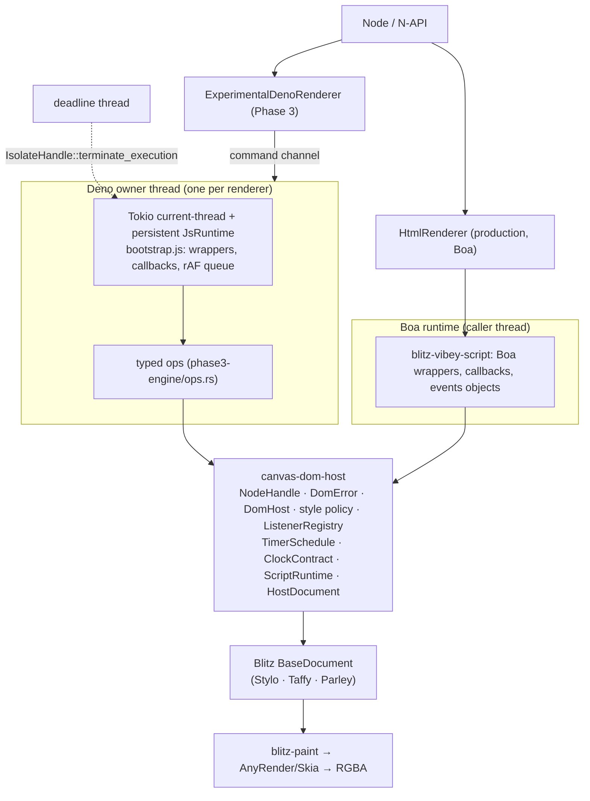

# canvas-html Phase 3 — shared DOM/Web host

Prepared 2026-10-06. Linux x64 only (4 vCPU, 15 GiB, kernel 6.18). Node 24.19.0, Rust 1.97.0,
`deno_core` 0.412.0, rusty_v8 (`v8` crate) 150.4.0, `boa_engine` 0.22.0, napi-rs 3.14, Skia
bindings 0.153.3, Blitz `0db8c74` + `upstream-patches/blitz` 0001–0013. `PHASE2_RESULTS.md` was
read completely before any code changed. Versions: `experiments/phase3/evidence/environment.txt`.

## Decision

**GO** — the shared engine-neutral DOM/Web host is ready to become the architectural center of
canvas-html.

The scope of this GO is the host and its adapter boundary. It is **not** a GO for Deno/V8 as the
production default: Boa stays the default, Deno stays experimental (see Recommendation).

## Executive summary

The architecture worked, measured end to end:

- One crate, `canvas-html/dom-host` (`canvas-dom-host`), owns the DOM/Web semantics of the
  targeted subset: handles, errors, selectors, text, attributes, `classList`, inline style,
  computed style, geometry, listener metadata, timer ordering and the clock contract. It depends
  on Blitz's document only. It has no Boa, deno_core, V8, napi, Skia or paint dependency
  (`cargo tree`, source check and a directed Graphify graph agree).
- **Boa (production) now uses it.** Blitz's Boa DOM (`blitz-vibey-script`) delegates the subset
  to the host through `upstream-patches/blitz/0013`. All production suites pass before and after:
  core, JavaScript, WAAPI, fonts and worker determinism. Blitz's own vibey-script suite also
  passes: 26 DOM tests, 2 Preact tests and 1 doc test.
- **Deno/V8 (experimental) uses the same host** through typed ops
  (`experiments/phase3/engine`). It keeps the Phase 2 dedicated-thread model. The whole Phase 2
  lifecycle matrix passes on it.
- **One engine-independent contract suite**: 30 cases, run unchanged on both engines.
  **30/30 pass on both, with identical observable results.** The same suite on the pre-Phase-3
  production Boa passes 15/29 non-diagnostic cases. Its failures were real Boa bugs that the
  shared host fixed, for example equal-deadline timers running in reverse order.
- **Determinism**: 5 fresh instances per engine replay identically. **Boa and Deno produce
  byte-identical RGBA frames** at 0/250/500/750/1000 ms. The hashes are also identical to the
  five published in `PHASE2_RESULTS.md`.
- **GSAP 3.15.0** (real CSSPlugin, selector tween) is exact in both engines, both as a paused
  tween seeked with `totalTime` and as unpaused ticker playback driven by virtual time only.
  Frames are byte-identical across engines and across both modes. There are no JS errors.
- **Performance**: no unacceptable regression. Boa DOM workloads are unchanged to slightly
  faster. One small constant was measured on Boa `render()` (about 10–15 µs per call; see
  Performance). The Deno adapter's typed ops make its DOM bridge 1.3–3.7× cheaper than Phase 2's
  JSON dispatch.

What does not work yet is listed under Remaining incompatibilities. The largest item is that
Motion runs on Boa but not on Deno: Deno lacks the `EventTarget` global and Web Animations.

## Final architecture



The engines adapt to the host; the host never adapts to an engine object model. The layout and
paint path (`BaseDocument` → `blitz-paint` → Skia) only sees Blitz node ids, through the host's
`HostDocument` trait.

Module map:

| Path | Role | May depend on |
|---|---|---|
| `canvas-html/dom-host/` | Shared DOM/Web host. Rust tests on a real Blitz document | `blitz-dom`, `serde_json` |
| `canvas-html/upstream-patches/blitz/0013-…patch` | Boa adapter (`blitz-vibey-script`) on the host | Boa, `canvas-dom-host`, Blitz |
| `canvas-html/src/lib.rs` | Production renderer (Boa default). New: `epochMs`, `close()`, `_dropNodeForTesting()` | Blitz, vibey-script, `canvas-dom-host`, Skia |
| `experiments/phase3/engine/` | Deno adapter: ops, bootstrap, watchdog, `ScriptRuntime` | `deno_core`/V8, `canvas-dom-host` |
| `experiments/phase3/addon/` | Experimental N-API renderer: owner thread, document/layout/paint | engine, `canvas-dom-host`, Blitz, Skia |
| `experiments/phase3/contract/` | Engine-independent contract suite, determinism, GSAP, Motion probe | the two Node APIs only |
| `experiments/phase3/tests/` | Phase 2 lifecycle matrix ported, memory probes, benchmarks | the two Node APIs only |
| `experiments/phase3/graphify/` | Directed code graph, layer analysis, crate graph | — |

`canvas-html/Cargo.toml` became a small workspace (`members = [".", "dom-host"]`,
`exclude = ["experiments"]`), so the host builds and tests with the production lockfile and
`[patch]` set. The experiments workspace gained `phase3/engine` and `phase3/addon`.

## Dependency boundaries

| Module | Boa | deno_core | V8 | Blitz DOM | Stylo | Skia/paint |
|---|---|---|---|---|---|---|
| `canvas-dom-host` | no | no | no | yes | via Blitz | **no** |
| Boa adapter (`blitz-vibey-script` + 0013) | yes | no | no | yes | via Blitz | no |
| `phase3-engine` (Deno adapter) | no | yes | yes (owner thread only) | yes (ops) | via Blitz | no |
| `phase3-addon/document.rs` (layout/paint) | no | no | no | yes | via Blitz | yes |
| `blitz-dom`, `blitz-paint`, AnyRender/Skia | no | no | no | — | yes | — |
| production `src/lib.rs` | via vibey-script | no | no | yes | via Blitz | yes |

Evidence: `experiments/phase3/evidence/dependency-boundaries.txt` and the layer report
`experiments/phase3/graphify/layers.json`. `cargo tree -i boa_engine` reaches only
`blitz-vibey-script` and `canvas-html`. `cargo tree -i v8` reaches only `deno_core` and the
phase2/phase3 engine and addon crates. `blitz-paint` and `anyrender_skia` have no Boa, V8 or host
dependency. A source scan finds no engine identifiers in the host or in the Deno layout/paint
module; the only hits are doc comments and `#![forbid(unsafe_code)]`.

### Graphify (directed)

Graphify **0.9.77** (`graphifyy`) was installed in an isolated venv. It ran as a local AST
extraction (`extract --code-only --no-cluster`): no LLM and no API key. Raw extraction keeps
Graphify's directed `source → target` edges (calls, references, imports, implements). The staged
corpus is the Phase 3 code: shared host, Boa adapter, Deno engine and addon, and the production
lib and prelude. That is 1,165 nodes and 3,533 directed edges.

`experiments/phase3/graphify/layers.py` classifies every node by layer and counts directed
cross-layer edges:

| From → to | Edges |
|---|---:|
| Boa adapter → Boa engine API | 776 |
| Deno engine → V8/deno_core API | 93 |
| Boa adapter → shared host | 75 |
| Deno engine → shared host | 32 |
| layout/paint (`deno_addon/document.rs`) → shared host | 3 |
| production → shared host / Boa adapter | 2 / 2 |
| **shared host → any engine or adapter** | **0** |
| **layout/paint → any engine or adapter** | **0** |

The directed graph caught one real wrong-direction dependency that `cargo tree` and the grep did
not. The first version had `deno_addon/document.rs` importing and implementing a `HostDocument`
trait defined in the **Deno engine** crate. That was a layout/paint → engine edge, although no
V8 type was involved. The trait moved into `canvas-dom-host`, and a re-extraction reports 0
forbidden-direction edges.

Graphify also reported one Boa adapter → Deno addon edge. It is a name-resolution false
positive: Boa's `impl Clock for BoaClockAdapter` resolved to the Deno addon's `Kind::Clock`
command variant. AST extraction resolves names, not types, so every reported boundary edge was
checked by hand.

`graphify extract --cargo` crashes on the root canvas-html workspace. Its glob of the member
`"."` raises `IndexError` in `cargo_introspect.py`, a Graphify bug. On the experiments workspace
it gives the crate graph (`crate-graph.json`): `phase3-addon → {canvas-dom-host, phase3-engine}`
and `phase3-engine → {canvas-dom-host, deno_core}`, with nothing pointing back.
`graphify diagnose multigraph --directed` output and an interactive `graph.html` are kept beside
it. The graph is a navigation aid, not a thread-safety proof.

## DOM contract matrix

All rows come from `experiments/phase3/contract` (`node run.mjs`), the same cases run on both
engines. "Before" is the identical suite on the pre-Phase-3 production Boa addon
(`evidence/contract-boa-v0.5-before.json`).

| Contract | Boa | Deno | Shared host? | Boa before | Notes |
|---|---|---|---|---|---|
| global aliases | pass | pass | — (adapter) | pass | `window`, `self`, `document.defaultView` |
| getElementById | pass | pass | yes | pass | missing → `null` |
| querySelector | pass | pass | yes | pass | document- and element-scoped; Blitz selector engine |
| querySelectorAll | pass | pass | yes | pass | **static Array**, not a live `NodeList` (documented deviation) |
| invalid selector | pass | pass | yes (`DomError::InvalidSelector`) | pass | `SyntaxError` DOMException in both |
| stable identity | pass | pass | yes (`NodeHandle`) | pass | wrapper caches are runtime-local, keyed by the handle; expandos persist |
| textContent | pass | pass | yes | pass | render reflects it; old children detached, not dropped |
| attributes | pass | pass | yes | pass | real `removeAttribute` (Phase 2 Deno wrote `""`), lowercase names |
| id / className | pass | pass | yes | pass | |
| classList | pass | pass | yes (token ops) | **fail** | identity, ordered set, `SyntaxError`/`InvalidCharacterError` validation |
| style identity | pass | pass | — (adapter cache) | **fail** | Boa returned a new Proxy per access |
| inline style | pass | pass | yes (`style` policy) | **fail** | one name policy (camel/kebab/vendor), Stylo validation, `length`/`item` |
| getComputedStyle | pass | pass | yes | **fail** | resolved by Blitz/Stylo after lazy layout; non-element → `TypeError` |
| getBoundingClientRect | pass | pass | yes | **fail** | detached → zeros (Boa before reported a stale box); offset/client sizes shared |
| createElement / tree | pass | pass | yes | pass | `appendChild`, `remove`, `parentElement`, `children`, `firstElementChild` |
| events | pass | pass | yes (`ListenerRegistry`) | **fail** | `new Event`/`CustomEvent`, `dispatchEvent`, bubbling to document and window, `once`, stop flags, `preventDefault` only when cancelable |
| errors: stale node | pass | pass | yes (`InvalidHandle`) | n/a | `InvalidStateError` for 8 operations after native drop |
| errors: wrong `this` | pass | pass | — | pass | `TypeError` |
| errors: closed renderer | pass | pass | — | n/a | "renderer is closed" (Boa gained `close()`) |
| eval exception, continued use | pass | pass | — | pass | indirect-eval scoping is the same in both (see below) |
| deterministic timers | pass | pass | yes (`ClockContract`, `TimerSchedule`) | **fail** | Boa before: wall-anchored `Date`, integer `performance.now`, reverse equal-deadline order, microtasks after a whole batch |
| rAF | pass | pass | contract (queues engine-local) | **fail** | runs at render, registration order, `performance.now()` timestamp |
| Promise ordering | pass | pass | contract | **fail** | microtasks drain after each timer, rAF batch and eval |
| GSAP selector tween | pass | pass | — (consumer) | (Phase 2) | see Determinism |
| unsupported operation | diagnostic | diagnostic | defined (`UnsupportedOperation` → `NotSupportedError`) | — | APIs outside the subset differ by engine (below) |

The diagnostic row records what exists outside the subset. On Boa: `animate`,
`getAnimations`, `createTextNode`, `matches`, `childNodes` and `fetch` exist. On Deno only the
subset exists. The host error `UnsupportedOperation` is defined but not reachable from the
subset. Calling an absent API is a `TypeError` (not a function) in Deno.

## Ownership / lifetime model

| Item | Owner | Lifetime / invalidation |
|---|---|---|
| Native nodes | Blitz `BaseDocument` slab. The canonical identity is the versioned `NodeHandle` (32-bit slot + 32-bit version) | Detaching (`remove()`, `textContent=`) keeps a node valid. A node becomes stale only when it is **dropped**: embedder teardown, or `_dropNodeForTesting(selector)`. Script cannot drop nodes in either engine. A reused slot gets a new version, so a stale handle never aliases a new node |
| Wrapper caches | Boa: `RuntimeState.node_wrappers` (`NodeId → JsObject`, GC roots). Deno: a `Map(handle → wrapper)` inside the isolate | One wrapper per handle, never the identity. Stale handles keep their cache entry until close. Every shared operation on a stale handle throws `InvalidStateError` |
| Style and `classList` objects | Boa: `style_wrappers` (`NodeId → Proxy`) plus a JS `WeakMap` for `classList`. Deno: `WeakMap`s keyed by wrapper | Same lifetime as the wrapper. The canonical style state is the element's `style` attribute in the document |
| Listener metadata | `canvas-dom-host::ListenerRegistry`: target, type, capture, once, order, `CallbackKey` | Removed by `removeEventListener`, by `once` at invocation, or by `clear()`/`remove_target()` |
| Listener callbacks | Boa: `CallbackTable` of rooted `JsObject`s in `RuntimeState`. Deno: `Map(key → function)` in the isolate | Released as soon as `callback_in_use(key)` is false. **No callback is stored in the shared layer**, and none crosses runtimes |
| Timer callbacks | Engine-local maps keyed by the shared `TimerId` | One-shot: removed when run. Cleared: removed at once. A timer cleared earlier in the same batch does not run (`begin_run` / `runTimer`) |
| rAF queue | Engine-local (Boa: canvas-html prelude; Deno: bootstrap). The rules are identical and contract-tested | Drained at each render |
| Renderer close | Boa: `close()` drops the document and runtime. Without it, Node GC finalization does the same. Deno: `close()`/finalizer sends Stop; the owner thread stops the watchdog, drops `JsRuntime` (and with it every V8 wrapper and callback), the document and the painter, then is joined | Idempotent. Later calls throw "renderer is closed" |
| Runtime shutdown (Deno) | `DenoRuntime::shutdown()` on the owner thread: watchdog joined **before** the isolate drops | Counters: `created == dropped`, `watchdogs == 0`, `executionThreads == 0` after every lifecycle test |
| V8 handles | Created, used and released on the renderer's owner thread only. The deadline thread holds only the thread-safe `IsolateHandle` | Nothing V8 is `Send`; the compiler rejects moving it. The owner check runs before every command |

## Determinism

Policy (both engines, `canvas-dom-host::clock::ClockContract`):
`Date.now() = floor(epochMs + visualTime)`, `performance.now() = visualTime` (fractional),
`performance.timeOrigin = epochMs`. Timers run at their own deadline in (deadline, insertion)
order, and microtasks drain after each callback. rAF runs once per render, before style and
layout, with `performance.now()` as its timestamp. No visual time is read from the wall clock.

The production Boa renderer keeps its previous default epoch (wall clock at load) unless
`epochMs` is passed. With `epochMs` it follows the contract exactly. Boa's virtual clock origin
now equals the virtual instant, so `performance.now()` is the exact clock time. Before, it was
`Date.now() - t0` in whole milliseconds.

**Date/timer/rAF scene, 5 fresh renderers per engine** (`evidence/determinism.json`,
`frames/dom-*.png`): every replay is identical within each engine, there are 5 distinct frames,
and Boa and Deno are byte-identical at every timestamp:

| Visual ms | Displayed `Date.now()` | RGBA SHA-256 (Boa = Deno = Phase 2) |
|---:|---:|---|
| 0 | 0 | `da91bf0d1f1a6f3f99f3304441924ded0d7c07a4d88f6a7fadd7771bee9f5900` |
| 250 | 250 | `76553f6221d52dbba23e3330e4c3d923bd69f35faa7930e8e43f9a45ce77cf2d` |
| 500 | 500 | `dd2863c6c09ad17159884e570a7d9b9d122e0185295dd0354e89eb9bcda4922d` |
| 750 | 750 | `476ad5e82cf482ade10e2dade079afac4cafc9ff73289e91b77a098223b99fa9` |
| 1000 | 1000 | `8e37c564dc285a6080107d8490bb226ccc1841462ef35c57879e8840ab318ece` |

These are the same five hashes `PHASE2_RESULTS.md` published for the Phase 2 Deno prototype. The
scene now runs its rAF step at render instead of at seek, which gives the same pixels for this
scene.

**GSAP 3.15.0**, `gsap.to("#box", {x: 100, opacity: 0.5, duration: 1, ease: "none"})`,
`lagSmoothing(0)` (`evidence/gsap.json`, `frames/gsap-*.png`). Paused + `totalTime` and unpaused
ticker playback give identical frames, in both engines:

| Visual ms | GSAP x | Computed opacity | Computed transform | RGBA SHA-256 (all 4 runs identical) |
|---:|---:|---:|---|---|
| 0 | 0 | 1 | `matrix(1, 0, 0, 1, 0, 0)` | `5674f8890e6d3e755dfe7b7ce5faaae588e23cd9ced36bc5e3f56f07c09687e3` |
| 250 | 25 | 0.875 | `matrix3d(…, 25, 0, 0, 1)` | `f897072e9445036401a35c8659db22cb436b430d799bd1e5c14bb74b049aae3c` |
| 500 | 50 | 0.75 | `matrix3d(…, 50, 0, 0, 1)` | `2fab8a5a3e7c587ed1161a2b3021de93046f9b058b90dfe9cdb8cdd624572f94` |
| 750 | 75 | 0.625 | `matrix3d(…, 75, 0, 0, 1)` | `df73b7013373af8f6851b78aeb3d08657e57ba690f8cc8f995c952651c2cac4f` |
| 1000 | 100 | 0.5 | `matrix(1, 0, 0, 1, 100, 0)` | `25e78ea415b5c01e18dcb30dbe0c9ef3e5c91b4b4b9a6af9238f1595071d8688` |

Mid-tween, GSAP writes `translate3d()` (its `force3D: "auto"`), so the computed value is a
`matrix3d`. Phase 2 reported `matrix(…)` at every step because its narrow style Proxy hid 3D
support from GSAP's feature detection. The shared Stylo-backed style object reports what Stylo
supports, as browsers do. Ticker playback in auto mode: at 0 ms GSAP has not ticked yet (inline
style empty, transform `none`); the pixels are still identical to the paused frame. There are no
JS errors in any run, and no Deno console output.

Cross-engine attribution: `contract/scenes.mjs` records each frame's DOM state, computed style,
clock values, layout rects and pixels. For a mismatch it reports the first differing layer
(DOM → style → timing → layout → paint). **No mismatch occurred** in any of the 15 compared
frames, so no attribution was needed. All PNGs were inspected: the date text, the colour change
at 500 ms, and the GSAP translation and fade are visible.

## Performance

Medians of 3 process runs, each the median of 5 samples, in ms per operation
(`evidence/benchmark-*-run{1,2,3}.json`, `benchmark-summary.json`). Same HTML, 160×64, Inter only.
"boa-before" is the pre-Phase-3 production addon rebuilt from the original commit with the same
toolchain. "deno-phase2" is the Phase 2 prototype addon. The "×100" workloads run 100 operations
in one `eval`.

| Workload | boa-before | boa | deno-phase2 | deno | Boundary |
|---|---:|---:|---:|---:|---|
| Construction + load | 40.51 | 42.43 | 15.55 | 16.57 | fonts + HTML + runtime (+ initial resolve in Phase 3 Deno) |
| First eval | 0.397 | 0.405 | 0.223 | 0.390 | N-API/RPC + compile + JSON |
| Warm eval `1+2` | 0.191 | 0.183 | 0.049 | 0.057 | N-API/RPC + compile + JSON |
| RPC, no JS | 0.0003 | 0.0003 | — | **0.028** | Boa getter vs Deno channel round trip |
| Sum loop 100k | 60.10 | 59.11 | 1.281 | 0.143 | complete eval call; Phase 3 runs it through indirect eval, and V8's code cache is a likely but unverified reason for the drop |
| 100 plain-object assignments | 0.428 | 0.423 | 0.068 | 0.073 | JS share of the DOM rows below |
| 100 style mutations (width + opacity) | 8.20 | 7.58 | 1.064 | 0.801 | JS + host bridge + Stylo validation (no layout) |
| querySelector ×100 | 0.377 | 0.372 | 0.454 | 0.121 | bridge + selector match |
| querySelectorAll ×100 | 0.477 | 0.637 | 0.362 | 0.183 | bridge + selector match |
| getComputedStyle ×100 (clean) | 4.80 | 5.25 | 0.442 | 0.337 | bridge + no-op resolve + resolved value |
| mutate + getComputedStyle ×100 | 13.34 | 12.13 | 2.272 | 1.991 | one restyle + relayout per iteration |
| getBoundingClientRect ×100 | 1.74 | 2.60 | 0.548 | 0.374 | bridge + resolve + rect |
| Seek, 1 ms step | 0.0004 | 0.0004 | 0.057 | 0.042 | scheduler + channel (Deno) |
| Render | 0.072 | 0.102 | 0.091 | 0.111 | rAF frame + layout + paint + Buffer |
| Seek + render | 0.075 | 0.091 | 0.151 | 0.154 | two calls |
| GSAP frame (advance 1/60 s + render) | 0.482 | 0.439 | 0.234 | 0.250 | ticker + CSSPlugin + layout + paint |

Deno render breakdown (inside the owner thread, 3 runs): rAF frame JS 0.021–0.024 ms, layout
0.004–0.005 ms, paint 0.047–0.051 ms. The remainder of the 0.111 ms public call, about
0.03 ms, is the channel hop plus Buffer creation, which matches the 0.028 ms no-JS RPC.

Reading:

- **Shared host on Boa.** The 3-run medians swing ±50% on this shared 4-core VM, so the
  disagreeing rows got a focused A/B: 5 alternating process pairs, 40 samples each
  (`evidence/ab-boa.txt`). Medians: `getBoundingClientRect` ×100 1.87 → 1.96 ms (+5%),
  `querySelectorAll` ×100 0.44 → 0.47 ms (+7%), both inside the noise band. `render` 0.063 →
  0.077 ms is slower in 4 of 5 pairs: **a small real constant of about 10–15 µs per render**.
  The source was not isolated; candidates are the per-call `performance.now()` native call and
  codegen differences from the new workspace member. It does not appear in real scenes: the
  1280×720 worker scenes run in 0.83–0.87 s after vs 0.85–0.88 s before, CSS motion with one
  renderer (`evidence/workers-before-after.txt`). Style mutations and computed style after a
  mutation got slightly faster, because the cached style object avoids a new Proxy per access.
- **Deno, Phase 2 → Phase 3.** The typed ops replace Phase 2's JSON request/response dispatch:
  querySelector ×100 3.7× cheaper, querySelectorAll 2×, getBoundingClientRect 1.5×, style
  mutations 1.3×. Phase 3 runs the rAF frame inside render (about 0.02 ms) instead of inside
  seek, so render is slower and seek faster. Seek + render is unchanged.
- **Chattiness.** One DOM call costs about 1–3 µs across the host bridge in Deno (the ×100 rows
  minus the plain-JS row). Crossing the Node↔Deno channel costs about 28 µs per public call, so
  the cost is in public-API granularity, not in JS↔DOM traffic. No batching was needed for
  Phase 3. If it becomes necessary, options are `renderAt(t)` (advance + render in one hop) or
  `renderFrames([...])`.
- **No universal speed claim.** V8 is much faster on JS-heavy work (loops, mutation-heavy
  scripts, the GSAP frame). Boa is faster for tiny public calls (seek, no-JS getters) because it
  has no thread hop. Construction is cheaper in Deno (16.6 vs 42.4 ms). The Boa figure includes the canvas-html
  prelude and vibey-script's bootstrap; it was not decomposed further.

## Existing-test preservation

| Suite | Before (v0.5 + Node 24.19.0) | After Phase 3 | Logs |
|---|---|---|---|
| `test/smoke.mjs` (core rendering) | passed | passed | `evidence/baseline/`, `evidence/regression-after/` |
| `test/smoke-js.mjs` (JavaScript, GSAP, Motion, Preact paths) | passed | passed | same |
| `test/smoke-waapi.mjs` (WAAPI) | passed | passed | same |
| `test/smoke-fonts.mjs` (fonts) | passed | passed | same |
| `test/workers.mjs 2` (worker determinism: CSS motion, GSAP, Motion library) | identical | identical | same + `workers-before-after.txt` |
| Blitz `blitz-vibey-script` tests (26 DOM + 2 Preact + 1 doc) | — | passed | `evidence/vibey-script-tests-after.log` |
| `canvas-dom-host` Rust tests (9 unit + 7 on a real document) | — | passed | `cargo test -p canvas-dom-host` |
| Phase 2 lifecycle matrix, ported to the Phase 3 addon | — | passed | `evidence/test-run-all.json` |

No assertion was weakened. Two Phase 2 test helpers changed. `seek` became `advanceTo`. And
`const box` became `globalThis.box`, because Deno's eval now uses indirect-eval scoping like
Boa's: top-level `let`/`const` do not persist between `eval` calls in either engine.

Boa's vibey-script tests need the patched Stylo even when Blitz is built standalone. They were
run with `--config patch.crates-io.stylo.path=../canvas-html/vendor/stylo`. Without it, Blitz
`0db8c74` + patches does not compile (`set_paused_time` comes from Stylo patch 0002). That is a
pre-existing setup constraint, unrelated to Phase 3.

### Deno lifecycle (Phase 2 matrix on the shared-host addon)

| Case | Result |
|---|---|
| Runtime contracts | eval exception then 42; backward time refused; double `close()`; eval timeout after 100.6 ms then `poisoned`; timeouts inside a Promise job, a timer callback and an rAF callback all stopped by the watchdog |
| Sequential cycles 1/10/100/1000 + 1000 GC-finalized | **2,111 created, 2,111 dropped**, 0 watchdog threads, 0 execution threads |
| One long-lived renderer | 10,000 eval + 10,000 advance + 1,000 render; runtime count stays 1 |
| Simultaneous 1/2/4/8/10/16 | non-LIFO close order; 41 created/dropped |
| Workers 1/2/4/8 graceful, exit with live renderer, 16 forced (8 idle, 8 busy), 16 repeated | 48 created/dropped; identical hashes per group |
| Forced termination | idle 3.4–8.2 ms; busy 252.5–260.1 ms with `evalTimeoutMs: 250` (watchdog-bounded, as in Phase 2) |
| Normal exit with 1 / 8 live renderers, explicit close then exit, exception then exit | every finalizer ran on its owner thread; final counts balanced |

Forced worker termination still waits for a pending synchronous native call. The watchdog bounds
JS, not an arbitrary native layout/paint stall.

## Memory observations

Current RSS **is** available in this container (`process.memoryUsage().rss`), unlike Phase 2. It
is reported with glibc `mallinfo2` native allocated bytes. RSS does not fall after frees: glibc
keeps freed arenas, so use native allocated bytes for retention.

| Probe (Phase 3 Deno unless noted) | Native allocated MiB | Current RSS MiB | Reading |
|---|---|---|---|
| 10,000 renders, no Node GC turns | 4.57 → 398.65 → **5.16 after Node GC while live** → 3.29 closed | 91.5 → 495.8 → 491.4 | unchanged Phase 2 finding: returned RGBA Buffers wait for Node finalizers |
| 10,000 renders, Node GC every 100 | 4.56 → 5.13 → 3.25 closed | 91.3 → 99.4 | flat |
| 10,000 evals / seeks / style writes | 4.57 → 5.21 / 4.58 / 5.25, then 3.2 closed | ~91 → 98–107 | bounded; style string stays 12 characters |
| 400 construct / construct+eval / construct+render cycles | 2.95 → 16.63 / 16.63 / 16.64 | 63 → 107–115 | about 35 KiB retained per cycle (see below) |
| 400 Boa paint cycles (scripts off) | 2.95 → 40.28 | 63 → 427 | retention also present without any script engine |
| 16 simultaneous renderers | 39.15 live → 8.07 after close | 177 live → 170 | about 1.32 MiB V8 heap per renderer |

**New clue about the unresolved Phase 2 retention.** In Phase 2, construct-only churn was flat
and render churn grew. The Phase 3 constructor now does the initial style/layout resolve that
the Boa renderer always did, and construct-only churn now grows exactly like render churn
(16.63 vs 16.64 MiB after 400). So the retained allocation follows the **first style/layout
resolve of a new document** (Stylo/Parley/fontique per-document setup is the likely area). It
does not follow paint, V8 or the shared host, and the Boa paint control retains as well. This is
an inference from controls, not an allocation-stack attribution; the exact owner is still
unresolved. No "no leak" claim is made. Phase 3 introduced no new growth: the long eval, seek
and style probes stay bounded, and listener and wrapper bookkeeping is released at close.

## Remaining incompatibilities

| # | Gap | Severity | Effort | Architectural risk |
|---|---|---|---|---|
| 1 | Only Linux x64 / Node 24.19.0 was run. Linux arm64, macOS arm64/x64 and Windows x64 had no runners | High for shipping Deno | Medium (CI) | Medium |
| 2 | Deno lacks Web Animations (`element.animate`, `getAnimations`) and the `EventTarget` global, so Motion fails on Deno (`evidence/motion-probe.json`). Boa has them through canvas-html's prelude and patches | High for Deno parity, none for Boa | Medium: move the WAAPI prelude's natives (`__blitz_set_animation_time`, animation lists) into the host and run the prelude on both engines | Low: same pattern as this phase |
| 3 | Native retention around a new document's first resolve (about 35 KiB per renderer) | Medium for long-lived services that churn renderers | Medium (allocation profiler) | Low for this architecture; likely Stylo/fontique |
| 4 | Patch 0013 makes Blitz's vibey-script depend on `../../../canvas-html/dom-host` by path, so it cannot go upstream as is | Medium (maintenance) | Medium: fold vibey-script's Boa DOM into canvas-html, or upstream the host as a Blitz crate | Low |
| 5 | Production Boa's default `Date` epoch is still the wall clock at load; determinism needs `epochMs` | Medium (a footgun for date-printing pages) | Small: change the default to 0 | Low; a behaviour change, so the owner decides |
| 6 | Event model: no capture phase (capture listeners run in bubble order), no `composedPath`, no trusted input events in Deno | Low for animation | Small–medium | Low |
| 7 | `querySelectorAll` returns a static Array, not a `NodeList`; no text nodes, `childNodes` or `matches` in Deno; Boa's wider DOM (outside the subset) is not shared yet | Medium for framework code (Preact runs on Boa only) | Medium, incremental: move more Boa natives behind the host | Low |
| 8 | Boa `render()` carries about 10–15 µs extra per call (cause not isolated) | Low (invisible at 1280×720) | Small | None |
| 9 | Script loading: HTML `<script>` runs on Boa at load, while the Deno renderer only runs `eval()` | Medium for Deno | Medium | Low |
| 10 | Stale handles occur only when an embedder drops nodes (tested through `_dropNodeForTesting`). Their wrapper-cache entries are kept until close | Low | Small | None |
| 11 | Forced worker termination waits for a native call; the watchdog cannot stop a native layout/paint hang | Low–medium | Medium | Low |

## Recommendation

> Is the shared engine-neutral DOM/Web adapter now strong enough to become the architectural
> center of canvas-html?

**Yes.** The production engine (Boa) and the experimental engine (Deno/V8) both run the targeted
subset through the same host. Their results are identical in 30 observable contracts, and their
pixels are byte-identical in deterministic replays and real GSAP playback. The host has no engine
dependency, and a directed graph shows nothing flowing back from the host or from layout/paint
into an engine. Further DOM work should land in `canvas-dom-host` first and be exposed by both
adapters, with each new behaviour added to `experiments/phase3/contract`.

> Should Boa remain production default while Deno/V8 continues as an experimental/optional
> runtime?

**Yes.** Boa remains the default: it passed every production suite and gained correctness from
the shared host. Deno/V8 is ready to continue as the experimental runtime **on the same host**.
Its lifecycle is unchanged and stable, and it is much faster on JS-heavy work. Before it can be
an option for real pages it needs gaps 1, 2 and 9 closed: platform validation, WAAPI/Motion
parity and script loading.

> Is the project ready to begin a separate GPU-backed Skia/WebGPU architecture phase after this,
> or are DOM/runtime blockers still too significant?

**Yes, a separate GPU phase can begin.** The DOM/runtime layer no longer constrains it: paint
only consumes Blitz's document, so a GPU-backed SkSurface can be evaluated without touching
either script engine. The remaining DOM gaps (WAAPI on Deno, wider DOM sharing) are incremental
and independent. They can continue in parallel, but they should not be mixed into the GPU
experiment. Phase 3 implemented no GPU, WebGPU, Three.js, GSS, CAD, networking or Node
compatibility work.

## Phase 3 acceptance checklist

- Architecture: one host ✔; Boa uses it ✔; Deno uses it ✔; no Boa/V8 handles in layout/paint ✔ (cargo, source and Graphify); stable native handles are the identity ✔; V8 stays on the owner thread ✔; Boa wrappers runtime-local ✔; callbacks engine-local ✔.
- Globals ✔. Selectors/identity (including invalid selectors and stable wrappers) ✔. Element basics ✔, plus `parentElement`/`children`/`firstElementChild` ✔.
- classList add/remove/contains/toggle ✔. Inline style: identity ✔, the 5 required properties ✔ and all 14 preferred ones ✔.
- Computed style: opacity/transform/width/height match ✔; serialization documented (Stylo; `matrix3d` mid-tween) ✔; native values, no JS guessing ✔.
- Geometry: all 8 fields ✔; from resolved layout ✔; mutation policy documented ✔ (`canvas-dom-host` lib docs: mutation marks dirty, layout-dependent queries resolve lazily at the document's current animation time, render resolves at the render time).
- Events: add/remove/dispatch, type/target/currentTarget, `preventDefault`/`defaultPrevented`, callbacks runtime-local ✔.
- Time: Date/performance/timeOrigin ✔; set/clearTimeout ✔; rAF/cancel ✔; Promise ordering ✔; no wall-clock dependency with `epochMs` ✔ (the Boa default epoch is gap 5).
- GSAP: runs in Boa and Deno ✔; real CSSPlugin ✔; 0/250/500/750/1000 ms ✔; opacity/transform ✔; ticker from virtual time ✔; rendered output ✔.
- Determinism: 5 fresh × 2 engines ✔; hashes recorded ✔; cross-engine attribution built in (no mismatch) ✔.
- Lifecycle: persistent, explicit close, finalizer close, worker graceful and forced, no wrong-thread destruction, watchdog ✔. Boa lifecycle tests ✔.
- Production regression: core, JS, WAAPI, fonts, worker determinism, GSAP, Motion ✔; no assertion weakened ✔.
- Performance: every listed workload measured ✔; JS separated from bridge, layout and paint where practical ✔; no universal speed claim ✔.
- Memory: no new regression ✔; pixel-buffer finalizer behaviour reproduced ✔; render-churn retention documented, with a new clue ✔; no "no leak" claim ✔.
- Scope: no WebGPU, wgpu, Dawn, Three.js, GSS, GPU Skia, CAD, networking, Node compatibility, full DOM or full WebIDL ✔.

## Reproduce

```bash
cd canvas-html
bash scripts/setup-blitz.sh                 # Blitz 0db8c74 + patches 0001–0013
npm run build && npm test && node test/workers.mjs 2
cargo test --release -p canvas-dom-host
cd experiments
cargo build --release --locked -p phase3-addon
cp target/release/libphase3_addon.so phase3/addon.node
cd phase3/contract && node run.mjs && node scenes.mjs
cd ../tests && node --expose-gc run.mjs     # lifecycle matrix
node --expose-gc benchmark.mjs boa          # boa | boa-before | deno | deno-phase2
```

`boa-before` needs `BOA_ADDON_PATH` pointing to a production addon built from the pre-Phase-3
commit. `deno-phase2` needs `experiments/phase2/addon.node` built from `phase2-addon`. Evidence
is under `experiments/phase3/evidence/`, and Graphify outputs are under
`experiments/phase3/graphify/`.
